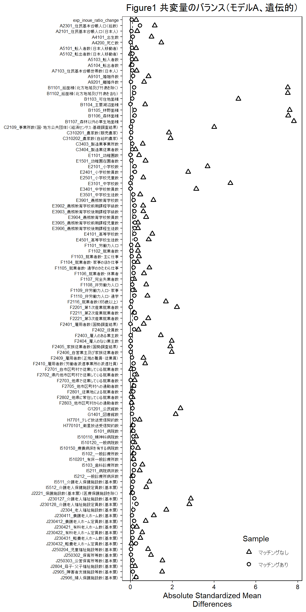
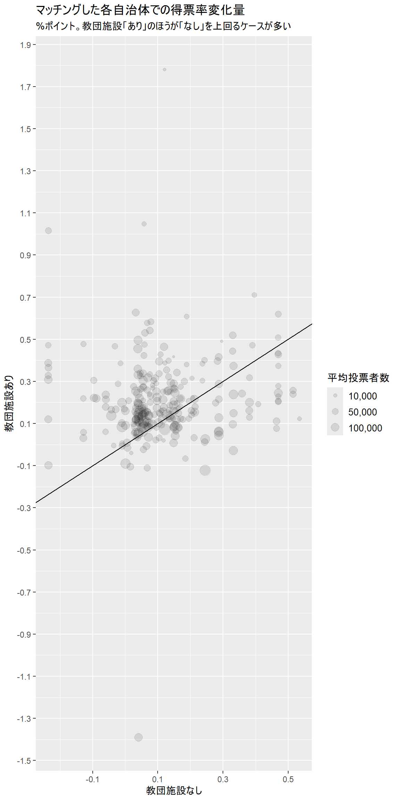

## この文書について
　日本選挙学会の機関誌「選挙研究」に掲載される予定の論文「旧統一教会が参院選に与えた影響の推定　自民党・井上義行氏の得票を例に」の分析手法や結果について、もとになったデータやRのコードとともに公開します。

## 必要なパッケージをとってくる

```{r message=FALSE}

library(tidyverse)
library(modelsummary)
library(MatchIt)
library(rgenoud)
library(cobalt)
library(zipangu)
library(estimatr)
library(gt)

if (!require("broom", character.only = TRUE)) {
  install.packages("broom")
  library("broom", character.only = TRUE)
}

```

## 元データを加工
　以下の四つのファイルを読み込み、分析用に加工する。

・各市区町村に割り振られたコード

・旧統一教会がウェブサイトで公表している「家庭教会」の所在地

・参院選における井上義行氏の得票記録

・e-Statから取得した各市区町村の「社会・人口統計体系」データ


```{r}

# 市区町村ごとに割り振られたコード
jiscode <- read_csv("data/提出用/jiscode.csv")

#旧統一教会の拠点289カ所がおかれた259自治体にタグを振る
church <- read_csv("data/提出用/教会所在地.csv") %>%
  mutate(address_components=separate_address(address)) %>%
  unnest_wider(col = address_components) %>%
  select(-address) %>% 
  mutate(prefecture=str_sub(prefecture,start=11,end=-1),
         pref_city=str_c(prefecture,city),
         uc=1) %>% 
  distinct(pref_city,uc) %>% 
  left_join(jiscode %>% select(code,pref_city)) %>% 
  select(code,uc)

# 井上氏の得票データを読み込み、「社会・人口統計体系」データを合体
inoue <- read_csv("data/提出用/votes.csv") %>%
  mutate(inoue_ratio=井上得票*100/投票者数,
         exp_inoue_ratio=(自民得票計-井上得票)*100/投票者数,
         ldp_ratio=自民_党_の得票*100/投票者数) %>%
  select(year,code,pref_city,inoue_ratio,exp_inoue_ratio,ldp_ratio) %>%
  pivot_wider(names_from = year,
              values_from = c(inoue_ratio,exp_inoue_ratio,ldp_ratio)) %>%
  mutate(inoue_ratio_change=inoue_ratio_2022-inoue_ratio_2019,
         exp_inoue_ratio_change=exp_inoue_ratio_2022-exp_inoue_ratio_2019,
         ldp_ratio_change=ldp_ratio_2022-ldp_ratio_2019) %>%
  dplyr::select(-inoue_ratio_2022,
                -inoue_ratio_2019,
                -exp_inoue_ratio_2022,
                -exp_inoue_ratio_2019,
                -ldp_ratio_2022,
                -ldp_ratio_2019) %>%
  left_join(church) %>%
  mutate(uc=ifelse(is.na(uc),0,1)) %>% 
  left_join(read_csv("data/提出用/mun_data.csv") %>% # 各市区町村の「社会・人口統計体系」データ
              select(-地域),
            by=c("code"="area_code")) %>% 
  select_if(negate(anyNA)) %>% # NAを含む列を除外
  select(-contains("（男）"), # 意味が重複する列を除外
         -contains("（女）"),
         -contains("（外国人）"),
          -contains("その他")) %>% 
  dplyr::select(code,pref_city,uc,inoue_ratio_change,exp_inoue_ratio_change,
                ldp_ratio_change,`A2301_住民基本台帳人口（総数）`,everything())

```

## 井上氏の得票に各変数が与える効果を調べる
　各変数を標準化したうえで、井上氏の得票率変化量を目的変数とした単回帰分析をして、それぞれの効果量を調べる。

```{r}

# 得票率とUC有無以外のすべての説明変数を人口で割る
for(i in 8:105){
  inoue[,i] <- inoue[,i]/inoue[,7]
}

# 井上氏の得票率変化量とUC有無以外のすべての変数を標準化
for(i in 5:105){
  inoue[,i] <- inoue[,i] %>%
    scale()
}

# 分析のためにデータフレーム形式に変える
inoue <- inoue %>% 
  as.data.frame()


# 各変数と井上氏の得票率変化量との単回帰分析をする
resFrame1<-data.frame() # forループのたびに上書きする一時的なデータフレーム
resFrame2<-data.frame() # 最終結果を書き込むデータフレーム

for(i in 5:105){
  result <- summary(lm(inoue$inoue_ratio_change~inoue[,i]))
  
  coef <- result$coefficients
  
  resFrame1 <- coef # i番目の出力結果を代入
  resFrame2 <- rbind(resFrame2,resFrame1) # resFrame2の末行にresFrame1を代入
}
```


　効果量の大きい順に変数を並べると以下のようになる。


```{r}

resFrame2 %>%
  as_tibble() %>%
  mutate(num=row_number()/2,
         int=ifelse(str_sub(num,-2,-2)==".",0,1)) %>%
  filter(int==1) %>%
  select(-int) %>%
  left_join(names(inoue) %>%
              as_tibble() %>%
              mutate(num=row_number()-4) %>%
              filter(num>=1) %>%
              rename(variable=value)) %>%
  mutate(abs_estimate=abs(Estimate)) %>%
  select(num,variable,everything()) %>%
  arrange(desc(abs_estimate)) %>% 
  knitr::kable()

```
| num|variable                                                         |   Estimate| Std. Error|    t value| Pr(>&#124;t&#124;)| abs_estimate|
|---:|:----------------------------------------------------------------|----------:|----------:|----------:|------------------:|------------:|
|  73|H7701_テレビ放送受信契約数                                       | -0.0438120|  0.0067474| -6.4931276|          0.0000000|    0.0438120|
|  11|A7103_住民基本台帳世帯数（日本人）                               | -0.0344873|  0.0067759| -5.0896695|          0.0000004|    0.0344873|
|  58|F2403_雇人のある業主数                                           | -0.0312255|  0.0067843| -4.6026146|          0.0000044|    0.0312255|
|  54|F2211_第2次産業就業者数                                          |  0.0280497|  0.0067916|  4.1300541|          0.0000378|    0.0280497|
|  74|H770101_衛星放送受信契約数                                       | -0.0271988|  0.0067934| -4.0036895|          0.0000648|    0.0271988|
|   5|A4101_出生数                                                     |  0.0265545|  0.0067948|  3.9080719|          0.0000963|    0.0265545|
|  51|F1110_非労働力人口・通学                                         |  0.0261241|  0.0067957|  3.8442263|          0.0001249|    0.0261241|
|   1|exp_inoue_ratio_change                                           | -0.0251714|  0.0067976| -3.7029965|          0.0002192|    0.0251714|
|  88|J230128_介護老人福祉施設定員数（基本票）                         | -0.0251376|  0.0067976| -3.6980006|          0.0002235|    0.0251376|
|  10|A5104_転出者数                                                   | -0.0234283|  0.0068009| -3.4449041|          0.0005837|    0.0234283|
|  30|E2501_小学校児童数                                               |  0.0233908|  0.0068009|  3.4393573|          0.0005957|    0.0233908|
|   8|A5102_転出者数（日本人移動者）                                   | -0.0221734|  0.0068031| -3.2593279|          0.0011366|    0.0221734|
|  67|F2705_他市区町村への通勤者数                                     |  0.0216796|  0.0068039|  3.1863491|          0.0014643|    0.0216796|
|  65|F2702_県内他市区町村で従業している就業者数                       |  0.0216616|  0.0068039|  3.1836868|          0.0014777|    0.0216616|
|   6|A4200_死亡数                                                     | -0.0208530|  0.0068053| -3.0642363|          0.0022130|    0.0208530|
|   3|A2301_住民基本台帳人口（総数）                                   |  0.0205608|  0.0068057|  3.0211013|          0.0025523|    0.0205608|
|  16|B1103_可住地面積                                                 | -0.0203284|  0.0068061| -2.9867843|          0.0028555|    0.0203284|
|  64|F2701_自市区町村で従業している就業者数                           | -0.0201710|  0.0068064| -2.9635530|          0.0030790|    0.0201710|
|  85|I5512_介護老人保健施設定員数（基本票）                           | -0.0201636|  0.0068064| -2.9624560|          0.0030900|    0.0201636|
|  33|E3501_中学校生徒数                                               |  0.0199719|  0.0068067|  2.9341615|          0.0033847|    0.0199719|
|  21|C2109_事業所数（国・地方公共団体）（経済センサス‐基礎調査結果） | -0.0193451|  0.0068076| -2.8416816|          0.0045357|    0.0193451|
|  25|C3404_製造業従業者数                                             |  0.0191186|  0.0068080|  2.8082732|          0.0050319|    0.0191186|
|  87|J230127_介護老人福祉施設数（基本票）                             | -0.0185773|  0.0068088| -2.7284404|          0.0064223|    0.0185773|
|  15|B1102_総面積（北方地域及び竹島を含む）                           | -0.0185752|  0.0068088| -2.7281357|          0.0064282|    0.0185752|
|  14|B1101_総面積（北方地域及び竹島を除く）                           | -0.0185647|  0.0068088| -2.7265875|          0.0064583|    0.0185647|
|  61|F2406_自営業主及び家族従業者数                                   | -0.0182216|  0.0068093| -2.6760066|          0.0075147|    0.0182216|
|  95|J230432_軽費老人ホーム定員数（基本票）                           |  0.0181220|  0.0068094|  2.6613200|          0.0078493|    0.0181220|
|  60|F2405_家族従業者数（国勢調査結果）                               | -0.0177122|  0.0068100| -2.6009188|          0.0093698|    0.0177122|
|  23|C310202_農家数（自給的農家）                                     |  0.0176357|  0.0068101|  2.5896446|          0.0096811|    0.0176357|
|  28|E2101_小学校数                                                   | -0.0174986|  0.0068103| -2.5694459|          0.0102620|    0.0174986|
|  53|F2201_第1次産業就業者数                                          | -0.0174842|  0.0068103| -2.5673235|          0.0103248|    0.0174842|
|  18|B1105_林野面積                                                   | -0.0172838|  0.0068106| -2.5377911|          0.0112350|    0.0172838|
|  20|B1107_森林以外の草生地面積                                       | -0.0169612|  0.0068110| -2.4902657|          0.0128499|    0.0169612|
|  19|B1106_森林面積                                                   | -0.0168347|  0.0068111| -2.4716402|          0.0135368|    0.0168347|
|  52|F2116_就業者数（65歳以上）                                       | -0.0165184|  0.0068116| -2.4250547|          0.0153990|    0.0165184|
|  62|F2409_雇用者数（正規の職員・従業員）                             |  0.0163157|  0.0068118|  2.3952032|          0.0167078|    0.0163157|
|  84|I5511_介護老人保健施設数（基本票）                               | -0.0158665|  0.0068124| -2.3290672|          0.0199602|    0.0158665|
|  98|J250303_公営保育所等数（基本票）                                 | -0.0158038|  0.0068125| -2.3198453|          0.0204551|    0.0158038|
|  83|I5212_一般診療所病床数                                           | -0.0154813|  0.0068128| -2.2723658|          0.0231761|    0.0154813|
|  29|E2401_小学校教員数                                               | -0.0153856|  0.0068130| -2.2582834|          0.0240414|    0.0153856|
|  27|E1501_幼稚園在園者数                                             |  0.0150361|  0.0068134|  2.2068487|          0.0274442|    0.0150361|
|  56|F2401_雇用者数（国勢調査結果）                                   |  0.0142447|  0.0068143|  2.0904178|          0.0367133|    0.0142447|
|  94|J230431_軽費老人ホーム数（基本票）                               |  0.0134095|  0.0068152|  1.9675919|          0.0492607|    0.0134095|
|  99|J2804_母子・父子福祉施設数（基本票）                             |  0.0133887|  0.0068152|  1.9645433|          0.0496131|    0.0133887|
|  63|F2410_雇用者数（労働者派遣事業所の派遣社員）                     |  0.0133843|  0.0068152|  1.9638904|          0.0496889|    0.0133843|
|  89|J2304_老人福祉施設数（基本票）                                   |  0.0123567|  0.0068162|  1.8128385|          0.0700150|    0.0123567|
|  40|E4101_高等学校数                                                 | -0.0123261|  0.0068162| -1.8083432|          0.0707117|    0.0123261|
|  57|F2402_役員数                                                     | -0.0122691|  0.0068163| -1.7999659|          0.0720251|    0.0122691|
|  49|F1108_非労働力人口                                               | -0.0120455|  0.0068165| -1.7671079|          0.0773712|    0.0120455|
|  82|I5211_病院病床数                                                 |  0.0120096|  0.0068165|  1.7618278|          0.0782597|    0.0120096|
|  55|F2221_第3次産業就業者数                                          | -0.0117624|  0.0068168| -1.7255163|          0.0845976|    0.0117624|
|  24|C3403_製造業事業所数                                             |  0.0117517|  0.0068168|  1.7239426|          0.0848814|    0.0117517|
|  32|E3401_中学校教員数                                               | -0.0110308|  0.0068174| -1.6180300|          0.1058226|    0.0110308|
|  68|F2801_従業地による就業者数                                       | -0.0107887|  0.0068176| -1.5824796|          0.1137071|    0.0107887|
|  46|F1105_就業者数・通学のかたわら仕事                               |  0.0107674|  0.0068176|  1.5793448|          0.1144240|    0.0107674|
|  31|E3101_中学校数                                                   | -0.0106863|  0.0068177| -1.5674378|          0.1171794|    0.0106863|
|  59|F2404_雇人のない業主数                                           | -0.0102719|  0.0068180| -1.5065799|          0.1320851|    0.0102719|
|  97|J250302_保育所等数（基本票）                                     | -0.0102150|  0.0068181| -1.4982230|          0.1342420|    0.0102150|
|   7|A5101_転入者数（日本人移動者）                                   | -0.0095574|  0.0068186| -1.4016648|          0.1611792|    0.0095574|
|   9|A5103_転入者数                                                   | -0.0095374|  0.0068186| -1.3987274|          0.1620585|    0.0095374|
|  72|G1401_図書館数                                                   |  0.0088796|  0.0068191|  1.3021686|          0.1930171|    0.0088796|
|  45|F1104_就業者数・家事のほか仕事                                   | -0.0088695|  0.0068191| -1.3006915|          0.1935223|    0.0088695|
|  12|A9101_婚姻件数                                                   |  0.0083544|  0.0068194|  1.2250869|          0.2206948|    0.0083544|
|  71|G1201_公民館数                                                   |  0.0082674|  0.0068195|  1.2123160|          0.2255426|    0.0082674|
|  96|J250204_児童福祉施設等数（基本票）                               | -0.0082506|  0.0068195| -1.2098607|          0.2264833|    0.0082506|
|  90|J230411_養護老人ホーム数（基本票）                               |  0.0081618|  0.0068195|  1.1968292|          0.2315229|    0.0081618|
|  17|B1104_主要湖沼面積                                               | -0.0081448|  0.0068196| -1.1943260|          0.2325000|    0.0081448|
|  80|I510201_有床一般診療所数                                         | -0.0076444|  0.0068199| -1.1209064|          0.2624698|    0.0076444|
|   2|ldp_ratio_change                                                 | -0.0073203|  0.0068201| -1.0733531|          0.2832495|    0.0073203|
|  76|I510110_精神科病院数                                             |  0.0070016|  0.0068202|  1.0265957|          0.3047420|    0.0070016|
|  79|I5102_一般診療所数                                               | -0.0067542|  0.0068204| -0.9902992|          0.3221544|    0.0067542|
|  81|I5103_歯科診療所数                                               | -0.0065236|  0.0068205| -0.9564794|          0.3389522|    0.0065236|
|  93|J230422_有料老人ホーム定員数（基本票）                           | -0.0063223|  0.0068206| -0.9269494|          0.3540709|    0.0063223|
|  78|I510150_療養病床を有する病院数                                   |  0.0063174|  0.0068206|  0.9262267|          0.3544462|    0.0063174|
|  69|F2802_他県に常住している就業者数                                 | -0.0062431|  0.0068206| -0.9153257|          0.3601372|    0.0062431|
|  47|F1106_就業者数・休業者                                           | -0.0061459|  0.0068207| -0.9010641|          0.3676688|    0.0061459|
|  91|J230412_養護老人ホーム定員数（基本票）                           |  0.0059050|  0.0068208|  0.8657396|          0.3867426|    0.0059050|
|  36|E3903_義務教育学校後期課程学級数                                 | -0.0049706|  0.0068212| -0.7287078|          0.4662705|    0.0049706|
|  13|A9201_離婚件数                                                   | -0.0048021|  0.0068212| -0.7039948|          0.4815226|    0.0048021|
|  34|E3901_義務教育学校数                                             | -0.0047784|  0.0068212| -0.7005220|          0.4836874|    0.0047784|
|   4|A2101_住民基本台帳人口（日本人）                                 | -0.0046982|  0.0068213| -0.6887547|          0.4910620|    0.0046982|
|  70|F2803_他市区町村からの通勤者数                                   | -0.0046321|  0.0068213| -0.6790653|          0.4971795|    0.0046321|
|  92|J230421_有料老人ホーム数（基本票）                               |  0.0044267|  0.0068214|  0.6489474|          0.5164511|    0.0044267|
|  37|E3904_義務教育学校教員数                                         | -0.0041806|  0.0068214| -0.6128586|          0.5400434|    0.0041806|
|  22|C310201_農家数（販売農家）                                       |  0.0038978|  0.0068215|  0.5713973|          0.5677981|    0.0038978|
|  39|E3906_義務教育学校後期課程生徒数                                 | -0.0037786|  0.0068216| -0.5539129|          0.5797038|    0.0037786|
|  38|E3905_義務教育学校前期課程児童数                                 | -0.0037783|  0.0068216| -0.5538749|          0.5797299|    0.0037783|
|  66|F2703_他県で従業している就業者数                                 |  0.0037620|  0.0068216|  0.5514856|          0.5813659|    0.0037620|
|  35|E3902_義務教育学校前期課程学級数                                 | -0.0036613|  0.0068216| -0.5367275|          0.5915189|    0.0036613|
| 101|J2906_婦人保護施設数（基本票）                                   |  0.0034579|  0.0068217|  0.5068994|          0.6122844|    0.0034579|
| 100|J2905_障害者支援施設等数（基本票）                               | -0.0033062|  0.0068217| -0.4846526|          0.6279788|    0.0033062|
|  26|E1101_幼稚園数                                                   |  0.0032439|  0.0068217|  0.4755188|          0.6344721|    0.0032439|
|  42|F1101_労働力人口                                                 | -0.0031255|  0.0068217| -0.4581673|          0.6468848|    0.0031255|
|  43|F1102_就業者数                                                   | -0.0028581|  0.0068218| -0.4189663|          0.6752882|    0.0028581|
|  77|I510120_一般病院数                                               | -0.0022168|  0.0068219| -0.3249564|          0.7452500|    0.0022168|
|  48|F1107_完全失業者数                                               | -0.0021213|  0.0068220| -0.3109486|          0.7558739|    0.0021213|
|  44|F1103_就業者数・主に仕事                                         | -0.0015716|  0.0068220| -0.2303774|          0.8178234|    0.0015716|
|  41|E4501_高等学校生徒数                                             |  0.0013567|  0.0068221|  0.1988688|          0.8423868|    0.0013567|
|  50|F1109_非労働力人口・家事                                         | -0.0006041|  0.0068221| -0.0885447|          0.9294531|    0.0006041|
|  86|J2221_保護施設数（基本票）（医療保護施設を除く）                 |  0.0005347|  0.0068221|  0.0783794|          0.9375345|    0.0005347|
|  75|I5101_病院数                                                     | -0.0000993|  0.0068221| -0.0145578|          0.9883865|    0.0000993|

## マッチングをしていく

　以下の３モデルのそれぞれについて、最近傍マッチングと遺伝的マッチングを行う。つまり計６パターンのマッチングをする。

A)	社会・人口統計体系から入手した98個の変数すべてに、井上氏以外の自民党得票率変化量を加えた計99個
B)	社会・人口統計体系の変数全体のうち効果量の大きいもの10個に、井上氏以外の自民党得票率変化量を加えた計11個
C)	社会・人口統計体系の各分野のうち効果量が最大の変数9個に、井上氏以外の自民党得票率変化量を加えた計10個

　まずは最近傍マッチングをする。

```{r echo = TRUE,message = FALSE, warning = FALSE,result='hide'}

# 各モデルで使う変数を指定する
varsA <- c("exp_inoue_ratio_change",
           "`A2301_住民基本台帳人口（総数）`",
           "`A2101_住民基本台帳人口（日本人）`",
           "`A4101_出生数`",
           "`A4200_死亡数`",
           "`A5101_転入者数（日本人移動者）`",
           "`A5102_転出者数（日本人移動者）`",
           "`A5103_転入者数`",
           "`A5104_転出者数`",
           "`A7103_住民基本台帳世帯数（日本人）`",
           "`A9101_婚姻件数`",
           "`A9201_離婚件数`",
           "`B1101_総面積（北方地域及び竹島を除く）`",
           "`B1102_総面積（北方地域及び竹島を含む）`",
           "`B1103_可住地面積`",
           "`B1104_主要湖沼面積`",
           "`B1105_林野面積`",
           "`B1106_森林面積`",
           "`B1107_森林以外の草生地面積`",
           "`C2109_事業所数（国・地方公共団体）（経済センサス‐基礎調査結果）`",
           "`C310201_農家数（販売農家）`",
           "`C310202_農家数（自給的農家）`",
           "`C3403_製造業事業所数`",
           "`C3404_製造業従業者数`",
           "`E1101_幼稚園数`",
           "`E1501_幼稚園在園者数`",
           "`E2101_小学校数`",
           "`E2401_小学校教員数`",
           "`E2501_小学校児童数`",
           "`E3101_中学校数`",
           "`E3401_中学校教員数`",
           "`E3501_中学校生徒数`",
           "`E3901_義務教育学校数`",
           "`E3902_義務教育学校前期課程学級数`",
           "`E3903_義務教育学校後期課程学級数`",
           "`E3904_義務教育学校教員数`",
           "`E3905_義務教育学校前期課程児童数`",
           "`E3906_義務教育学校後期課程生徒数`",
           "`E4101_高等学校数`",
           "`E4501_高等学校生徒数`",
           "`F1101_労働力人口`",
           "`F1102_就業者数`",
           "`F1103_就業者数・主に仕事`",
           "`F1104_就業者数・家事のほか仕事`",
           "`F1105_就業者数・通学のかたわら仕事`",
           "`F1106_就業者数・休業者`",
           "`F1107_完全失業者数`",
           "`F1108_非労働力人口`",
           "`F1109_非労働力人口・家事`",
           "`F1110_非労働力人口・通学`",
           "`F2116_就業者数（65歳以上）`",
           "`F2201_第1次産業就業者数`",
           "`F2211_第2次産業就業者数`",
           "`F2221_第3次産業就業者数`",
           "`F2401_雇用者数（国勢調査結果）`",
           "`F2402_役員数`",
           "`F2403_雇人のある業主数`",
           "`F2404_雇人のない業主数`",
           "`F2405_家族従業者数（国勢調査結果）`",
           "`F2406_自営業主及び家族従業者数`",
           "`F2409_雇用者数（正規の職員・従業員）`",
           "`F2410_雇用者数（労働者派遣事業所の派遣社員）`",
           "`F2701_自市区町村で従業している就業者数`",
           "`F2702_県内他市区町村で従業している就業者数`",
           "`F2703_他県で従業している就業者数`",
           "`F2705_他市区町村への通勤者数`",
           "`F2801_従業地による就業者数`",
           "`F2802_他県に常住している就業者数`",
           "`F2803_他市区町村からの通勤者数`",
           "`G1201_公民館数`",
           "`G1401_図書館数`",
           "`H7701_テレビ放送受信契約数`",
           "`H770101_衛星放送受信契約数`",
           "`I5101_病院数`",
           "`I510110_精神科病院数`",
           "`I510120_一般病院数`",
           "`I510150_療養病床を有する病院数`",
           "`I5102_一般診療所数`",
           "`I510201_有床一般診療所数`",
           "`I5103_歯科診療所数`",
           "`I5211_病院病床数`",
           "`I5212_一般診療所病床数`",
           "`I5511_介護老人保健施設数（基本票）`",
           "`I5512_介護老人保健施設定員数（基本票）`",
           "`J2221_保護施設数（基本票）（医療保護施設を除く）`",
           "`J230127_介護老人福祉施設数（基本票）`",
           "`J230128_介護老人福祉施設定員数（基本票）`",
           "`J2304_老人福祉施設数（基本票）`",
           "`J230411_養護老人ホーム数（基本票）`",
           "`J230412_養護老人ホーム定員数（基本票）`",
           "`J230421_有料老人ホーム数（基本票）`",
           "`J230422_有料老人ホーム定員数（基本票）`",
           "`J230431_軽費老人ホーム数（基本票）`",
           "`J230432_軽費老人ホーム定員数（基本票）`",
           "`J250204_児童福祉施設等数（基本票）`",
           "`J250302_保育所等数（基本票）`",
           "`J250303_公営保育所等数（基本票）`",
           "`J2804_母子・父子福祉施設数（基本票）`",
           "`J2905_障害者支援施設等数（基本票）`",
           "`J2906_婦人保護施設数（基本票）`")


varsB <- c("exp_inoue_ratio_change",
           "`A4101_出生数`",
           "`A5104_転出者数`",
           "`A7103_住民基本台帳世帯数（日本人）`",
           "`E2501_小学校児童数`",
           "`F1110_非労働力人口・通学`",
           "`F2211_第2次産業就業者数`",
           "`F2403_雇人のある業主数`",
           "`H7701_テレビ放送受信契約数`",
           "`H770101_衛星放送受信契約数`",
           "`J230128_介護老人福祉施設定員数（基本票）`")

varsC <- c("exp_inoue_ratio_change",
           "`A7103_住民基本台帳世帯数（日本人）`",
           "`B1103_可住地面積`",
           "`C2109_事業所数（国・地方公共団体）（経済センサス‐基礎調査結果）`",
           "`E2501_小学校児童数`",
           "`F2403_雇人のある業主数`",
           "`G1401_図書館数`",
           "`H7701_テレビ放送受信契約数`",
           "`I5512_介護老人保健施設定員数（基本票）`",
           "`J230128_介護老人福祉施設定員数（基本票）`")


# モデルAの最近傍マッチング

model_a_n <- matchit(as.formula(paste("uc ~", paste(varsA, collapse = " + "))),
                     mehod = "nearest",
                     distance = "mahalanobis",
                     data=inoue)


# モデルBの最近傍マッチング

model_b_n <- matchit(as.formula(paste("uc ~", paste(varsB, collapse = " + "))),
                     mehod = "nearest",
                     distance = "mahalanobis",
                     data=inoue)

# モデルCの最近傍マッチング

model_c_n <- matchit(as.formula(paste("uc ~", paste(varsC, collapse = " + "))),
                     mehod = "nearest",
                     distance = "mahalanobis",
                     data=inoue)


```


　次に遺伝的マッチングをする。マッチングのための様々なパラメータは以下の通り。

 
method = "genetic",

distance = "mahalanobis",

pop.size = 1000, 

nboots = 1000,

replace = TRUE,

verbose = TRUE,

estimand = "ATT"


```{r include = FALSE}

# 遺伝的マッチングの条件設定
pop.size <- 1000
nboots <- 1000

# モデルAの遺伝的マッチング

model_a_g <- matchit(as.formula(paste("uc ~", paste(varsA, collapse = " + "))),
                     method = "genetic",
                     distance = "mahalanobis",
                     pop.size = pop.size, 
                     nboots = nboots, 
                     replace = TRUE,
                     verbose = TRUE,
                     estimand = "ATT",
                     data=inoue)

# モデルBの遺伝的マッチング

model_b_g <- matchit(as.formula(paste("uc ~", paste(varsB, collapse = " + "))),
                     method = "genetic",
                     distance = "mahalanobis",
                     pop.size = pop.size, 
                     nboots = nboots, 
                     replace = TRUE,
                     verbose = TRUE,
                     estimand = "ATT",
                     data=inoue)


# モデルCの遺伝的マッチング

model_c_g <- matchit(as.formula(paste("uc ~", paste(varsC, collapse = " + "))),
                     method = "genetic",
                     distance = "mahalanobis",
                     pop.size = pop.size, 
                     nboots = nboots, 
                     replace = TRUE,
                     verbose = TRUE,
                     estimand = "ATT",
                     data=inoue)

```

## マッチングの結果を確認

　共変量のバランスを確かめる。いずれのモデルでも遺伝的マッチングのほうがAbsolute Standardized Mean Differencesの平均値が小さくなる。つまり、よりよいマッチングができている。

```{r}
# モデルA、最近傍
balance_a_n <- bal.tab(model_a_n,un=TRUE)
balance_a_n$Balance %>%
  as_tibble() %>%
  mutate(un_abs_mean_dif=abs(Diff.Un),
         adj_abs_mean_dif=abs(Diff.Adj)) %>%
  summarize(mean(un_abs_mean_dif),
            mean(adj_abs_mean_dif))

# モデルA、遺伝的
balance_a_g <- bal.tab(model_a_g,un=TRUE)
balance_a_g$Balance %>%
  as_tibble() %>%
  mutate(un_abs_mean_dif=abs(Diff.Un),
         adj_abs_mean_dif=abs(Diff.Adj)) %>%
  summarize(mean(un_abs_mean_dif),
            mean(adj_abs_mean_dif))

# モデルB、最近傍
balance_b_n <- bal.tab(model_b_n,un=TRUE)
balance_b_n$Balance %>%
  as_tibble() %>%
  mutate(un_abs_mean_dif=abs(Diff.Un),
         adj_abs_mean_dif=abs(Diff.Adj)) %>%
  summarize(mean(un_abs_mean_dif),
            mean(adj_abs_mean_dif))

# モデルB、遺伝的
balance_b_g <- bal.tab(model_b_g,un=TRUE)
balance_b_g$Balance %>%
  as_tibble() %>%
  mutate(un_abs_mean_dif=abs(Diff.Un),
         adj_abs_mean_dif=abs(Diff.Adj)) %>%
  summarize(mean(un_abs_mean_dif),
            mean(adj_abs_mean_dif))

# モデルC、最近傍
balance_c_n <- bal.tab(model_c_n,un=TRUE)
balance_c_n$Balance %>%
  as_tibble() %>%
  mutate(un_abs_mean_dif=abs(Diff.Un),
         adj_abs_mean_dif=abs(Diff.Adj)) %>%
  summarize(mean(un_abs_mean_dif),
            mean(adj_abs_mean_dif))


# モデルC、遺伝的
balance_c_g <- bal.tab(model_c_g,un=TRUE)
balance_c_g$Balance %>%
  as_tibble() %>%
  mutate(un_abs_mean_dif=abs(Diff.Un),
         adj_abs_mean_dif=abs(Diff.Adj)) %>%
  summarize(mean(un_abs_mean_dif),
            mean(adj_abs_mean_dif))


```


## 教団施設の効果を確認
　マッチングした市区町村を比べ、教団施設の有無によって井上氏の得票率変化量がどれだけ変わるかを見てみる。いずれのモデル、マッチング法でも0.07%ポイント前後で、有意な値となっている。


```{r}

# モデルA、最近傍
data_a_n <- get_matches(model_a_n) %>%
  as_tibble() %>%
  left_join(read_csv("data/提出用/votes.csv") %>%
              filter(year==2022) %>%
              dplyr::select(code,投票者数))

summary(lm(inoue_ratio_change ~ uc, data = data_a_n, weights = 投票者数))
confint(lm(inoue_ratio_change ~ uc, data = data_a_n, weights = 投票者数))

# モデルA、遺伝的
data_a_g <- get_matches(model_a_g) %>%
  as_tibble() %>%
  left_join(read_csv("data/提出用/votes.csv") %>%
              filter(year==2022) %>%
              dplyr::select(code,投票者数))

summary(lm(inoue_ratio_change ~ uc, data = data_a_g, weights = 投票者数))
confint(lm(inoue_ratio_change ~ uc, data = data_a_g, weights = 投票者数))

# モデルB、最近傍
data_b_n <- get_matches(model_b_n) %>%
  as_tibble() %>%
  left_join(read_csv("data/提出用/votes.csv") %>%
              filter(year==2022) %>%
              dplyr::select(code,投票者数))

summary(lm(inoue_ratio_change ~ uc, data = data_b_n, weights = 投票者数))
confint(lm(inoue_ratio_change ~ uc, data = data_b_n, weights = 投票者数))


# モデルB、遺伝的
data_b_g <- get_matches(model_b_g) %>%
  as_tibble() %>%
  left_join(read_csv("data/提出用/votes.csv") %>%
              filter(year==2022) %>%
              dplyr::select(code,投票者数))

summary(lm(inoue_ratio_change ~ uc, data = data_b_g, weights = 投票者数))
confint(lm(inoue_ratio_change ~ uc, data = data_b_g, weights = 投票者数))

# モデルC、最近傍
data_c_n <- get_matches(model_c_n) %>%
  as_tibble() %>%
  left_join(read_csv("data/提出用/votes.csv") %>%
              filter(year==2022) %>%
              dplyr::select(code,投票者数))

summary(lm(inoue_ratio_change ~ uc, data = data_c_n, weights = 投票者数))
confint(lm(inoue_ratio_change ~ uc, data = data_c_n, weights = 投票者数))


# モデルC、遺伝的
data_c_g <- get_matches(model_c_g) %>%
  as_tibble() %>%
  left_join(read_csv("data/提出用/votes.csv") %>%
              filter(year==2022) %>%
              dplyr::select(code,投票者数))

summary(lm(inoue_ratio_change ~ uc, data = data_c_g, weights = 投票者数))
confint(lm(inoue_ratio_change ~ uc, data = data_c_g, weights = 投票者数))


```

## 良いマッチングができていることをグラフで確認
　モデルAの遺伝的マッチングを例に、共変量のバランスがマッチングによって大幅に改善されていることを確認する。

```{r fig.width=6, fig.height=12}
love.plot(model_a_g,
          threshold = 0.1,
          abs = TRUE,
          colors=c("black","black"),
          shapes = c("triangle filled", "circle filled"),
          sample.names = c("マッチングなし","マッチングあり"),
          title="Figure1 共変量のバランス（モデルA、遺伝的）") +
  theme(legend.position = c(0.8, 0.05),
        axis.text.y = element_text(size = 6)) # 縦軸のテキストサイズを小さくする

```



## 井上氏の得票率変化量の違いをグラフで確認
　モデルAで遺伝的マッチングをした各市区町村のペアをみると、教団施設のある自治体のほうが、ない自治体より井上氏の得票率増え幅が大きいケースが多い。

```{r fig.width=6, fig.height=12}

data_a_g %>%
  select(subclass, uc, inoue_ratio_change, 投票者数) %>%
  group_by(subclass) %>%
  mutate(mean_vote = mean(投票者数)) %>%
  select(subclass, uc, inoue_ratio_change, mean_vote) %>%
  pivot_wider(names_from = uc, values_from = inoue_ratio_change) %>%
  rename(平均投票者数 = mean_vote, 教団施設あり = `1`, 教団施設なし = `0`) %>%
  ggplot(aes(x = 教団施設なし, y = 教団施設あり, size = 平均投票者数)) +
  geom_point(alpha = .1) +
  geom_abline(slope = 1, intercept = 0) +
  scale_size_continuous(breaks = c(10000, 50000, 100000),
                        labels = c("10,000", "50,000", "100,000")) +
  scale_x_continuous(breaks = seq(-0.3,0.7,by=0.2)) +
  scale_y_continuous(breaks = seq(-1.5,2, by = 0.2)) +
  theme(legend.title = element_text(size = 12),
        legend.text = element_text(size = 10)) +
  labs(title = "マッチングした各自治体での得票率変化量",
       subtitle = "%ポイント。教団施設「あり」のほうが「なし」を上回るケースが多い")

```



## 付録

DID分析をする。

```{r appendix}

inoue2019_2022 <- read_csv("data/提出用/votes.csv") %>%
  select(-自民_党_の得票) %>% 
  left_join(church)

did <- inoue2019_2022 %>%
  mutate(inoue_ratio=井上得票*100/投票者数,
         exp_inoue_ratio=(自民得票計-井上得票)*100/投票者数,
         uc=ifelse(is.na(uc),0,1),
         year_dummy=ifelse(year==2022,1,0)) %>%
  select(-有権者数,-井上得票,-自民得票計) %>%
  select(year,code,pref_city,inoue_ratio,everything()) %>% 
  left_join(read_csv("data/提出用/mun_data.csv") %>%
              select(-地域),
            by=c("code"="area_code")) %>%
  select_if(negate(anyNA)) 

controls <- colnames(did)[9:128] %>%
  sapply(function(x) {
    x <- sub("^", "`", x)
    sub("$", "`", x)
    })

# DID分析

lm(as.formula(paste("inoue_ratio ~ year_dummy + uc + year_dummy:uc + exp_inoue_ratio +",
                    paste(controls, collapse = " + "))),
   data = did, weights = 投票者数) %>% 
  tidy() %>% 
  mutate(across(estimate:statistic, ~format(., scientific = FALSE, digits = 3))) %>%
  mutate(across(estimate:p.value, ~format(., scientific = TRUE, digits = 3))) %>% 
  gt()


inoue2013 <- read_csv("data/提出用/福元データ23.csv") %>%
  mutate(年=(as.double(as.double(str_sub(選挙回,-2,-1)))-19)*3+2001) %>%
  mutate(名前=str_replace(名前," ","")) %>%
  filter(名前=="井上義行") %>%
  rename(pref=都道府県名,
         city=市区町村名,
         井上得票=市区町村別得票数,
         party="党派・会派等",
         name=名前,
         year=年,
         code=JISコード) %>%
  select(year,
         code,
         pref,
         city,
         name,
         井上得票,
         投票者数,
         有権者数) %>% 
  mutate(code=as.character(ifelse(str_length(code)==4,str_c(0,code),code))) %>% 
  mutate(city=str_replace(city,"ケ","ヶ"))


did_chart <- bind_rows(inoue2013, read_csv("data/提出用/votes.csv") %>%
                         select(-自民_党_の得票)) %>%
  left_join(church) %>%
  group_by(year,uc) %>%
  summarize(井上得票=sum(井上得票),
            投票者数=sum(投票者数)) %>%
  mutate(inoue_ratio=井上得票*100/投票者数) %>%
  mutate(uc=ifelse(is.na(uc), "なし", "あり")) %>%
  ggplot(aes(year,inoue_ratio,color=uc))+geom_line() +
  scale_x_continuous(breaks = c(2013, 2019, 2022)) +
  scale_color_manual(name = "教団施設",
                     values = c("あり" = "red", "なし" = "blue")) +
    labs(title="3回の参院選における井上氏の得票率の推移",
         x="年",
         y="得票率（％）")

# Define the points and the slope for the new line
x1 <- 2019
y1 <- 0.19
slope <- 0.03266667
x2 <- 2022
y2 <- y1 + slope * (x2 - x1)

# Add the line segment to the plot
did_chart + geom_segment(aes(x = x1, y = y1, xend = x2, yend = y2),
                         color = "black", linetype = "dotted")

```

以上。
