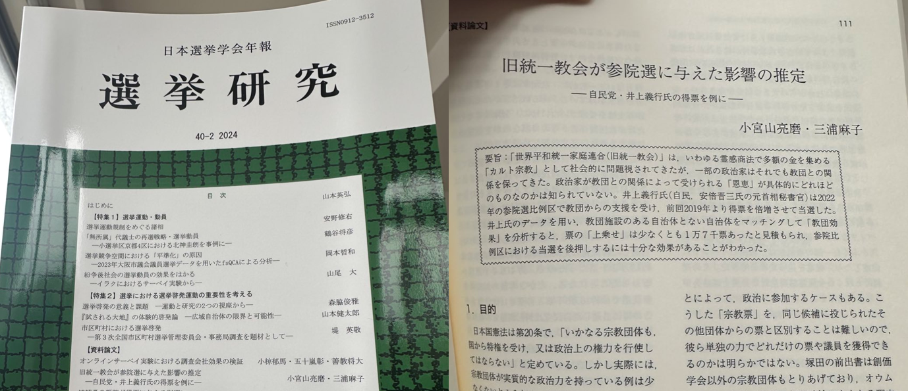

# 旧統一教会が参院選に与えた影響を推定した論文について

朝日新聞デジタル企画報道部　小宮山亮磨   
@ryomakom   
2024/5/23  

「旧統一教会が参院選に与えた影響の推定　自民党・井上義行氏の得票を例に」という論文が、日本選挙学会の機関誌「[選挙研究](https://www.jaesnet.org/research/publications/index.html)」に掲載いただけることになりました。掲載に先立ち、概要を説明します。

安倍晋三氏の元首相秘書官だった井上義行氏は、「世界平和統一家庭連合（旧統一教会）」からの支援を受けた2022年の参院選比例区で、前回2019年参院選と比べて得票を倍増させて当選しました。これは教団による支援の結果だと言えるのか？　もしそうなら、教団効果で得票は具体的にどれくらい増えたのか？　カルト宗教として社会から問題視される教団との関係を保ちたくなるほど、その得票増効果は魅力的なものなのか？　それを明らかにするのがこの論文の目的です。

注目したのが、教団が信者コミュニティーの中心と位置づけている「家庭教会」という施設です。この施設のある自治体ではおそらく信者らの活動がより活発で、井上氏の得票の増え幅も大きいのではないか。こうした仮説を立てて各自治体の得票データを調べました。施設のある全国259の自治体を、施設の有無以外の条件が極めてよく似ている別の自治体と「マッチング」させてペアをつくり、両者を比較したのです。

すると、施設のある自治体での得票の増え幅は、施設のないところより約0.07%ポイント多かったとの結果が出ました。施設のある259自治体では2022年の参院選で約2380万人が投票したので、0.07％ポイントは約1万7千票に相当します。施設のない自治体においても信者の活動はあるはずなので、1万7千票というのは参院選比例区全体で上乗せされる票の「最低限」の数字とみることができます。

2022年の参院選では、自民党の候補は比例区で11万9千票あれば当選できました。したがって、教団の支援によって得られる票は、巨大政党で票の配分をする大物政治家にとっても、配分してもらう候補者にとっても、確かに極めて魅力的なものだったと言えそうです。

井上氏が教団施設のある自治体で得票を伸ばしていたという結果は、当初は2022年8月の朝日新聞記事として[発表しました](https://digital.asahi.com/articles/ASQ8K7VY0Q8CULEI001.html)。この調査を原型にして、マッチングの手法を適用した結果を2023年5月の日本選挙学会で[ポスター発表](https://github.com/ryomakom/UC_inoue/blob/main/%E9%81%B8%E6%8C%99%E5%AD%A6%E4%BC%9A%E3%83%9D%E3%82%B9%E3%82%BF%E3%83%BC.pdf)し、さらにその後、論文のかたちにまとめました。

共著者の三浦麻子・大阪大教授には、朝日新聞に掲載される前の段階からさまざまな助言をいただき、論文化やその後の査読対応でも手取り足取りご指導（ダメだし）いただきました。また、福元健太郎・東京大教授からは、マッチングをすればよいとの助言を朝日新聞記事掲載の後にいただき、さらにポスター発表の後には「論文にすべき」との激励までいただきました。ここまでたどり着いたのはお二人のおかげです。

論文の掲載はいつなのかまだわかりませんが、ひとまずデータとコードを[こちら](https://ryomakom.github.io/UC_inoue2/)で公開します。

## 追記：掲載されました

2024年の年報2本目が2025年5月に刊行されました。よかったよかった。そして、長かったぁ。

